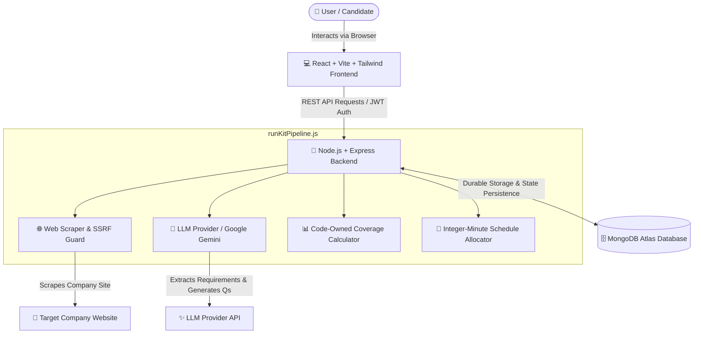
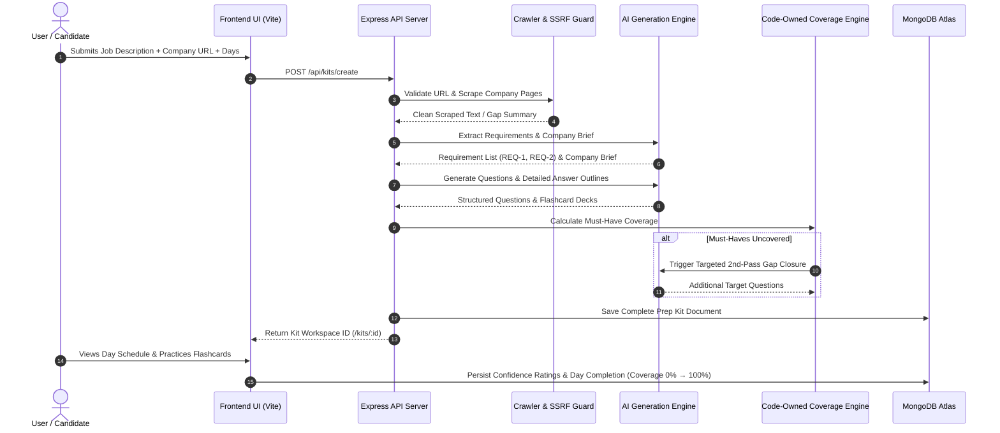

# ⚡ AI Interview Prep Kit — Full-Stack AI Platform

A production-grade, full-stack AI Interview Preparation system engineered strictly according to the **AI Interview Prep Kit Master Blueprint**.

---

## 🎯 What This Project Is About

**ViperAI Interview Prep Kit** transforms any job description URL and company website into a personalized, role-specific interview preparation kit. It automates web crawling, requirement extraction, targeted question and detailed answer outline generation, 100% requirement coverage validation, integer-minute daily schedule allocation, builder state preservation, and an interactive flashcard practice loop.

---

## 🏗 System Architecture Diagram



---

## 🔄 End-to-End Data Flow Pipeline



---

## 🌐 Application URL Routes & Data Flow Map

### 1. Frontend Route Map
| Route URL | Page Component | Purpose & Data Flow |
| :--- | :--- | :--- |
| `/` | `LandingPage.jsx` | Public landing page showcasing product capabilities, features, and pricing tiers. |
| `/login` | `LoginPage.jsx` | User authentication login form issuing JWT tokens. |
| `/register` | `RegisterPage.jsx` | User account registration form. |
| `/dashboard` | `DashboardPage.jsx` | Main candidate hub displaying Recent Kits (max 2 cards), average coverage, total questions, and practice quick links. |
| `/create` | `CreateKitPage.jsx` | Kit creation form with Company URL, Job Description, Seniority Selector, and single-button spinner generation. |
| `/kits` | `KitsListPage.jsx` | All Interview Kits list workspace with search filter, rename, duplicate, and delete actions. |
| `/kits/:id` | `KitDetailPage.jsx` | Detailed Kit Workspace containing 5 tabs: **Overview**, **Role Specs**, **Question Builder**, **Flashcards**, and **Schedule**. |
| `/flashcards` | `FlashcardsPage.jsx` | Full-screen interactive Flashcard Practice workspace with confidence level rating. |
| `/schedule` | `SchedulePage.jsx` | Day-by-day 5-day study plan with expand modal (`DayQuestionDetailsModal`) and day completion toggles. |
| `/plans` | `PlansPage.jsx` | Plan selection workspace (Free: 10, Mid: 25, Pro: 50, Ultra Pro: 100) with Razorpay integration. |
| `/profile` | `ProfilePage.jsx` | Profile editor, avatar selector, subscription badge, and account security options. |
| `/help` | `HelpSupportPage.jsx` | Help desk & FAQs center detailing pipeline mechanics, coverage, and state rules. |

---

### 2. Backend REST API Endpoint Map
| HTTP Method & Endpoint | Controller Action | Purpose |
| :--- | :--- | :--- |
| `POST /api/auth/register` | `registerUser` | Registers new user account with hashed password. |
| `POST /api/auth/login` | `loginUser` | Authenticates user credentials & returns JWT bearer token. |
| `GET /api/auth/me` | `getCurrentUser` | Returns active user profile & subscription tier details. |
| `GET /api/kits` | `listKits` | Retrieves all active prep kits owned by the candidate. |
| `POST /api/kits/create` | `createKit` | Triggers retrieval $\to$ AI generation $\to$ coverage $\to$ schedule pipeline. |
| `GET /api/kits/:id` | `getKit` | Retrieves full prep kit document by ID (auto-syncs schedule if questions updated). |
| `GET /api/kits/:id/status` | `getKitStatus` | Polls asynchronous kit generation progress (`pending`, `researching`, `generating`, `completed`). |
| `PUT /api/kits/:id` | `updateKit` | Updates questions, answer outlines, requirement states (`pinned`, `edited`), or schedule completion. |
| `POST /api/kits/:id/regenerate` | `regenerateKitSection` | Regenerates 5 new AI questions while preserving edited/pinned user items and re-dividing day schedules. |
| `POST /api/kits/:id/duplicate` | `duplicateKit` | Creates a copy of an existing interview prep kit. |
| `DELETE /api/kits/:id` | `deleteKit` | Deletes prep kit document from database. |
| `POST /api/practice/:id/confidence` | `updateConfidence` | Persists flashcard confidence rating (`1 Very weak` to `5 Strong`). |

---

## 🔒 Security & Code vs. AI Boundary Rules

1. **Strict Code vs. AI Responsibilities**:
   - **AI owns**: Semantic analysis, JD parsing, company summary, question prompt phrasing, and detailed answer outlines.
   - **Code owns**: SSRF URL validation, requirement IDs (`REQ-1`), 100% must-have coverage calculation, 2nd-pass triggering, integer-minute schedule partitioning ($N$ questions $\div$ $D$ days), builder state preservation, and retries.

2. **Builder State Preservation Matrix**:
   - `generated`: Default item created by AI pipeline; can be replaced during section regeneration.
   - `edited`: Item modified by user; **must survive** section regeneration.
   - `manual`: Custom question created by user from scratch; **must survive** regeneration.
   - `pinned`: Item explicitly locked by user; **never overwritten** unless unpinned.

3. **SSRF & Content Security**:
   - Validates all input URLs before crawling via `urlSafety.js`.
   - Rejects loopback & private IP ranges (`10.x.x.x`, `192.168.x.x`, `127.0.0.1`) in production.
   - Scraped text is treated strictly as untrusted data rather than prompt instructions.

---

## 🚀 Setup & Execution Guide

### 1. Prerequisites
- Node.js (v18+)
- MongoDB Atlas cluster URL or local MongoDB instance.

### 2. Environment Setup
Create `.env` inside `backend/`:
```env
PORT=5000
MONGODB_URI=mongodb+srv://your_mongo_url
JWT_SECRET=your_jwt_secret_key
GEMINI_API_KEY=your_google_gemini_api_key
```

### 3. Install Dependencies & Run
```bash
# Backend Setup & Launch
cd backend
npm install
npm run dev

# Frontend Setup & Launch
cd ../frontend
npm install
npm run dev
```

The application will run at:
- **Frontend App**: `http://localhost:3000`
- **Backend API**: `http://localhost:5000`

---

## 🧪 Automated Tests & Headless Evaluation

### 1. Run Automated Test Suites
```bash
cd backend
npm test
```
Runs Jest test suites for:
- Deterministic coverage & 2nd pass gap calculation (`coverage.test.js`)
- Integer-minute schedule allocation & priority ordering (`schedule.test.js`)
- Builder state preservation (`builder.test.js`)

### 2. Run Headless Batch Evaluator (`evaluate.js`)
```bash
node backend/scripts/evaluate.js --input ./backend/tests/fixtures/sample_input.json --output ./backend/tests/fixtures/sample_output.json
```
Runs the full retrieval $\to$ generation $\to$ coverage $\to$ schedule pipeline headlessly for automated benchmark evaluation.
